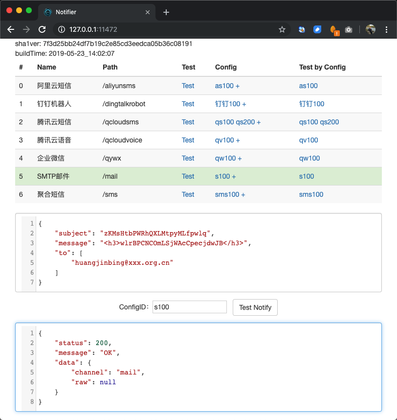

# notify4g
notify api for sms/voice/qywx/mail/dingtalk

## build

for release:

1. `./build.sh` for local
1. `./build.sh -t linux` for linux version
 
```bash
$ ./build.sh -h
Usage: ./build.sh [OPTION]...

  -t target   linux/local, default local
  -u yes/no   enable upx compression if upx is available or not
  -b          binary name, default notify4g
  -h          display help
```

for dev:

1. `go get github.com/bingoohuang/statiq`
1. `./buildres.sh`
1. `statiq -src=res`
1. `go fmt ./...;sh build.sh`

## Startup example

1. `./notify4g -i -s "~/notify4g/snapshot"` to init ctl shell scripts.
1. or by `export NOTIFY4G_SNAPSHOTDIR=~/notify4g/snapshotenv` to specified snapshotDir.

## snapshots



## outer network required

1. `dysmsapi.aliyuncs.com:80`
1. `oapi.dingtalk.com:443`
1. `yun.tim.qq.com:443`
1. `cloud.tim.qq.com:443`
1. `qyapi.weixin.qq.com:443`
1. `mail.capmail.cn:25`

## Curl scripts

1. `curl 'http://127.0.0.1:11472/notify/sms100' --data '{"templateParams":{"code":"1234"},"mobiles":["18678901234"],"retry":0}'`

## Request & Response Examples

API document style refers to [White House Web API Standards](https://github.com/WhiteHouse/api-standards).

### API Resources

所有API都可以通过界面点击，然后在Chrome的开发工具的Network中查看详情。

* 获得直接发送通知的请求体样例 [GET /raw/:channel](#get-rawchannel)
* 直接根据配置和内容发送通知 [POST /raw/:channel](#post-rawchannel)
* 获取配置详情 GET /config/:configID
* 获得指定渠道配置样例 GET /config/:configID/:channel
* 新增/保存配置 POST /config/:configID
* 删除配置 DELETE /config/:configID
* 获得指定配置请求体样例 GET /notify/:configID
* 根据配置发送请求 POST /notify/:configID

### GET /raw/:channel

<details><summary>GET /raw/aliyunsms</summary>
<p>
Response body:

```json
{
    "config": {
        "accessKeyID": "BvXitpxZTiQPBPJNHzKEyUtZX",
        "acessKeySecret": "EaouuhLQvkjvBpcqjySEaDtZp",
        "templateCode": "jHsEdCAyjQiwwKfKTIAyMwhLd",
        "signName": ""
    },
    "data": {
        "templateCode": "",
        "templateParams": {
            "VIbvxqDAKzYvRCOugkfSTdBii": "HUzqgIrkvrpoUvwfOnPkYWJCc",
            "nSodfKtCBsGOdFcFIfhRfKkQD": "MhBpCGIHwwFSTrekZojpWHHRj"
        },
        "signName": "",
        "mobiles": [
            "13640030119"
        ]
    }
}
```

</p>
</details>
<details><summary>GET /raw/dingtalkrobot</summary>
<p>
Response body:

```json
{
    "config": {
        "accessToken": "bmluXMmkzbKJXhHvRYnPWEFon"
    },
    "data": {
        "message": "uxuNAGIvNfwPHCppEJGAFbbJb",
        "atMobiles": [
            "16231720931",
            "12123690368"
        ],
        "atAll": true
    }
}
```

</p>
</details>
<details><summary>GET /raw/qcloudsms</summary>
<p>
Response body:

```json
{
    "config": {
        "sdkappid": "VIsOIVUTXKvmznGCfpklQBsHl",
        "appkey": "jyuRWrnndYwTzEQIDtpaulCEv",
        "tplID": 58,
        "sign": "",
        "tmplVarNames": [
            "NtAOrrDyTQZprXHlRyMKIQVrJ"
        ]
    },
    "data": {
        "params": [
            "DfQeutEzaCfShlItCeaEkTUGF",
            "DZiVFEPPlMANVxGwaCVjypmXA"
        ],
        "mobiles": [
            "15923459113",
            "18923435937"
        ]
    }
}
```

</p>
</details>
<details><summary>GET /raw/qcloudvoice</summary>
<p>
Response body:

```json
{
    "config": {
        "sdkappid": "dqpaGfzwZsdYPeOyCsiCnHuLe",
        "appkey": "HQFbAYSZWVMAhuzBkneOovYpv",
        "tplID": 39,
        "playTimes": 49,
        "tmplVarNames": [
            "KyzjUzrBFcqQjedfJRHYoDbOG",
            "nflOHIkugcnZOrqBkSazNWfPP"
        ]
    },
    "data": {
        "params": {
            "RIsCQnfJqlpSCwrkkFbdBFIFj": "XXcLBedVQEUDCnYApsnqfVPTL"
        },
        "mobile": "13534814833"
    }
}
```

</p>
</details>
<details><summary>GET /raw/qywx</summary>
<p>
Response body:

```json
{
    "config": {
        "corpID": "uCgrmJMtqLPBCFhsvjTArsMmL",
        "corpSecret": "gRHZGuimGqaWdWaBWJwkTAShU",
        "agentID": "GjqWAhwRbpeHnQNxTNgmJjnxD"
    },
    "data": {
        "msg": "SlooidCOblAgkzyWhxDcYtLJJ",
        "userIds": [
            "yFeNmhPfjtisROYMvzGXHlQpd",
            "CUSPjJkWEEfDDKDOfOhAXkqgJ"
        ]
    }
}
```

</p>
</details>
<details><summary>GET /raw/mail</summary>
<p>
Response body:

```json
{
    "config": {
        "smtpAddr": "xaQHabaoaboiqLQkrhnMSwTGo",
        "smtpPort": 94,
        "from": "CEVyoTJ@zTADH.biz",
        "username": "gQVadOOpmwpHnlIyfsCCBulVP",
        "pass": "NvMQhtbtbJgCkOErmOqWRCSKa"
    },
    "data": {
        "subject": "kfYENjIqRgtAsNATTewtSQJtK",
        "message": "nbUGDoWZCCUeCgZnqaHOhlDUc",
        "to": [
            "RyBZMmL@NbhCr.net",
            "fKggIDs@WHkmM.net"
        ]
    }
}
```

</p>
</details>
<details><summary>GET /raw/sms</summary>
<p>
Response body:

```json
{
    "config": {
        "configIds": [
            "NCCNkSbvLCcEBYPRpErzuHOzu",
            "qJoxwNVZfRxOytgzHbfYLSnNg"
        ],
        "random": false,
        "retry": 0
    },
    "data": {
        "templateParams": {
            "CAatGFIenVaglyBHaqLGDVNDm": "HmVmUYwDzaKJZvYwyMqYAAowJ",
            "uCbSRZgyNkgIntizzDrIHVOiy": "TNvBcIHcgrHoiKEGjEsktAKmn"
        },
        "mobiles": [
            "14509804092"
        ],
        "retry": 0
    }
}
```

</p>
</details>

### POST /raw/:channel

<details><summary>POST /raw/aliyunsms</summary>
<p>
Request body:

```json
{
    "config": {
        "accessKeyID": "pGkWHwdlIFPxNbwOuzqqHudVk",
        "acessKeySecret": "MuIuTxqaaqPFOqNtVZGGxyIVJ",
        "templateCode": "SMS_11111",
        "signName": "xx编程网"
    },
    "data": {
        "templateCode": "",
        "templateParams": {
            "code": "123456"
        },
        "signName": "",
        "mobiles": [
            "11350758197",
            "12414111245"
        ]
    }
}
```

Response body:

```json
{
  "status": 200,
  "message": "OK",
  "data": {
    "channel": "aliyunsms",
    "raw": {
      "outId": "yOpBUzo90hnezrhs",
      "code": "OK",
      "message": "OK",
      "requestID": "E4F3D966-002D-4D5D-BFA5-10E547334434",
      "bizID": "831713858682882984^0"
    }
  }
}
```

</p>
</details>
<details><summary>POST /raw/dingtalkrobot</summary>
<p>
Request body:

```json
{
    "config": {
        "accessToken": "RICScixPcBbEJRMdcvNPTqkUr"
    },
    "data": {
        "message": "WYouyJaLExAVGGWpTVumZgXhZ",
        "atMobiles": [
            "10707297593",
            "18621963646"
        ],
        "atAll": false
    }
}
```

Response body:

```json
{
    "status": 200,
    "message": "OK",
    "data": {
        "channel": "dingtalkrobot",
        "raw": {
            "code": 0,
            "message": ""
        }
    }
}
```

</p>
</details>
<details><summary>POST /raw/qcloudsms</summary>
<p>
Request body:

```json
{
    "config": {
        "sdkappid": "erKoSpOlNAKZgTBwZWsyKuSHt",
        "appkey": "aQtuUztXdxpTFcPsdnowkiBUK",
        "tplID": 34,
        "sign": "",
        "tmplVarNames": [
            "oIpzKCYbQmBEaiWXeCPOYwFEG"
        ]
    },
    "data": {
        "params": [
            "QxIiueXozjhTVNMhdANVnYMvR"
        ],
        "mobiles": [
            "14432444366"
        ]
    }
}
```

Response body:

```json
{
    "status": 200,
    "message": "OK",
    "data": {
        "channel": "qcloudsms",
        "raw": {
            "result": 0,
            "errmsg": "OK",
            "ext": "",
            "detail": [
                {
                    "fee": 1,
                    "mobile": "18551855099",
                    "nationcode": "86",
                    "sid": "2019:6646899365302911964",
                    "result": 0,
                    "errmsg": "OK"
                }
            ]
        }
    }
}
```

</p>
</details>
<details><summary>POST /raw/qcloudvoice</summary>
<p>
Request body:

```json
{
    "config": {
        "sdkappid": "nCQtPPaOBnGymUUMmcjWRvxra",
        "appkey": "jdWinpYVkCusHaznjRBxSghoq",
        "tplID": 15,
        "playTimes": 1,
        "tmplVarNames": ["AppName", "WarnSrc", "WithMinutes", "Warning", "Min", "Max"]
    },
    "data": {
        "params": {
            "AppName": "demo", "WarnSrc": "host1", "WithMinutes": "5分", "Warning": "可用内存不足", "Min": "100M", "Max": "200M"
        },
        "mobile": "13388093706"
    }
}
```

Response body:

```json
{
    "status": 200,
    "message": "OK",
    "data": {
        "channel": "qcloudvoice",
        "raw": {
            "result": 0,
            "errmsg": "OK",
            "callid": "bef3d1ce-7df8-11e9-aa35-52540075d5e6",
            "ext": ""
        }
    }
}
```

</p>
</details>
<details><summary>POST /raw/qywx</summary>
<p>
Request body:

```json
{
    "config": {
        "corpID": "TavUQCHdZPmNTkeszuHITWFai",
        "corpSecret": "YiomBBitrBsEqINJYLpSnpXIe",
        "agentID": "1000002"
    },
    "data": {
        "msg": "DPhnPBkYHnKTIltUTvqZqriNS",
        "userIds": [
            "huangjinbing"
        ]
    }
}
```

Response body:

```json
{
    "status": 200,
    "message": "OK",
    "data": {
        "channel": "qywx",
        "raw": {
            "errcode": 0,
            "errmsg": "ok",
            "invaliduser": "",
            "invalidparty": "",
            "invalidtag": ""
        }
    }
}
```

</p>
</details>
<details><summary>POST /raw/mail</summary>
<p>
Request body:

```json
{
    "config": {
        "smtpAddr": "iPtbQlchfAcisTedBhGwWsoZz",
        "smtpPort": 2,
        "from": "ExTWPRT@gYNcz.org",
        "username": "xfAdFgSoGYsPsupEGKPUqnIzf",
        "pass": "lBPKGnydFjkaGjBrEdufObPwt"
    },
    "data": {
        "subject": "jagoWiJBpkulohboaWqPgZZMo",
        "message": "PycUxHOvIUqKuHhcJouyJPsUL",
        "to": [
            "mCypiaF@TOuRk.net",
            "jrrEYOi@FQMlD.ru"
        ]
    }
}
```

Response body:

```json
{
    "status": 200,
    "message": "OK",
    "data": {
        "channel": "mail",
        "raw": null
    }
}
```

```json
{
    "status": 400,
    "message": "dial tcp: lookup TfdZkPmcNDQFtfAEdRQfgzQkZ: no such host",
    "data": {
        "channel": "mail",
        "raw": null
    }
}
```

</p>
</details>
<details><summary>POST /raw/sms</summary>
<p>
Request body:

```json
{
    "config": {
        "configIds": [
            "as100",
            "qs200"
        ],
        "random": true,
        "retry": 0
    },
    "data": {
        "templateParams": {
            "code": "123456"
        },
        "mobiles": [
            "14509804092"
        ],
        "retry": 0
    }
}
```

Response body:

```json
{
    "status": 200,
    "message": "OK",
    "data": {
        "channel": "aliyunsms",
        "raw": {
            "outId": "9q2hoGoxwyoBM4wx",
            "code": "OK",
            "message": "OK",
            "requestID": "6A8F6D26-AE2B-475F-B603-3886454F0587",
            "bizID": "410500758684794600^0"
        }
    }
}
```

```json
{
    "status": 200,
    "message": "OK",
    "data": {
        "channel": "qcloudsms",
        "raw": {
            "result": 0,
            "errmsg": "OK",
            "ext": "",
            "detail": [
                {
                    "fee": 1,
                    "mobile": "14509804092",
                    "nationcode": "86",
                    "sid": "8:fCI6QdTlfniajRq3qCK20190524",
                    "result": 0,
                    "errmsg": "OK"
                }
            ]
        }
    }
}

```


</p>
</details>